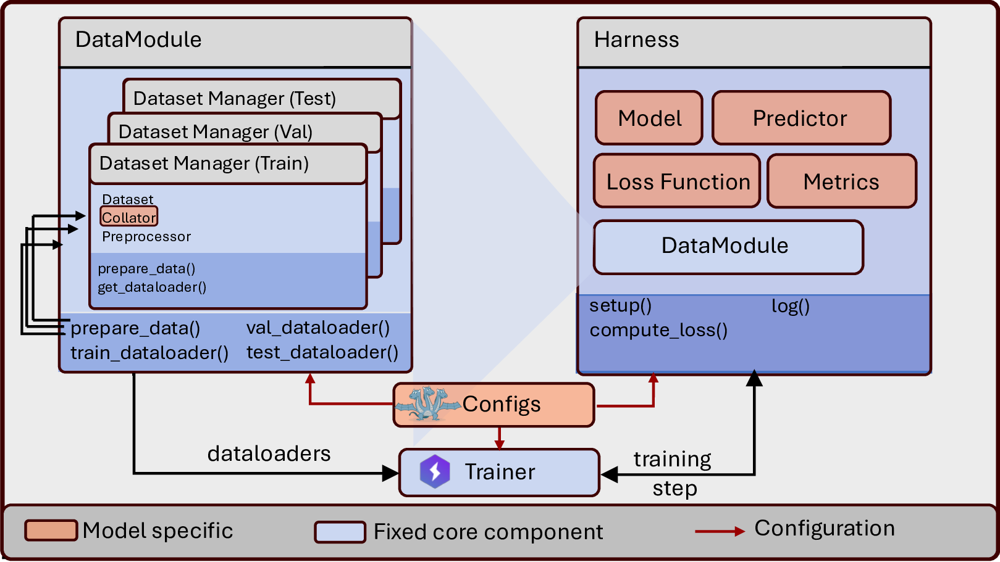

<p align="center">
  
</p>

<p align="center">
  <strong>A Research First Framework for Training and Evaluating Non-Autoregressive Language Models</strong>
</p>

<p align="center">
  <a href="https://pypi.org/project/xlm-core/"></a>
  <a href="https://codecov.io/gh/dhruvdcoder/xlm-core"></a>
  <a href="https://dhruveshp.com/xlm-core/dev/"></a>
  <a href="https://arxiv.org/abs/2512.17065"></a>
  <a href="https://github.com/dhruvdcoder/xlm-core"></a>
  <a href="https://github.com/dhruvdcoder/xlm-core/blob/main/LICENSE"></a>
</p>

---

XLM is a modular framework for developing and comparing non-autoregressive language models. It is built on [PyTorch Lightning](https://github.com/Lightning-AI/pytorch-lightning) and [Hydra](https://hydra.cc/).

## Design

<p align="center">
  
</p>

- **Composition over inheritance** — core components (Harness, DataModule) delegate model-specific logic to swappable instances (Model, Loss, Predictor, Collator).
- **Copy over branching** — each model family is a self-contained package; `xlm-scaffold` copies a working template instead of branching shared code.
- **Arbitrary code injection** — Hydra resolves any importable Python callable by dotted path. Your preprocessing, loss, predictor, collator, and metrics can live in any package — XLM wires them at runtime via YAML.

## Models, datasets, and metrics

**Models:** [ARLM](https://dhruveshp.com/xlm-core/dev/models/arlm/) · [MLM](https://dhruveshp.com/xlm-core/dev/models/mlm/) · [ILM](https://dhruveshp.com/xlm-core/dev/models/ilm/) · [MDLM](https://dhruveshp.com/xlm-core/dev/models/mdlm/) · [FlexMDM](https://dhruveshp.com/xlm-core/dev/models/flexmdm/) · Dream

**Datasets:** LM1B · OpenWebText · UniRef50 · QM9 · SAFE · Sudoku · Graph coloring · N-queens · Star graphs · …

**Metrics:** Loss · Exact match · Token accuracy · Generative perplexity · Parsability · Seq2seq EM · …

→ [Models overview](https://dhruveshp.com/xlm-core/dev/models/)

<details>
<summary><strong>Model families (papers and docs)</strong></summary>

The companion package [`xlm-models`](https://github.com/dhruvdcoder/xlm-core/tree/main/xlm-models) registers six families (see [`xlm_models.json`](https://github.com/dhruvdcoder/xlm-core/blob/main/xlm-models/xlm_models.json)). Cross-family comparison: [Models overview](https://dhruveshp.com/xlm-core/dev/models/).

| Tag | Name | Docs | State | Paper / notes |
|-----|------|------|-------|---------------|
| `arlm` | Autoregressive LM (baseline) | [Guide](https://dhruveshp.com/xlm-core/dev/models/arlm/) | Beta | — |
| `ilm` | Insertion language model | [Guide](https://dhruveshp.com/xlm-core/dev/models/ilm/) | Beta | [arXiv:2505.05755](https://arxiv.org/abs/2505.05755) |
| `mdlm` | Masked diffusion LM | [Guide](https://dhruveshp.com/xlm-core/dev/models/mdlm/) | Beta | [arXiv:2406.07524](https://arxiv.org/abs/2406.07524) |
| `mlm` | Masked language model (BERT-style) | [Guide](https://dhruveshp.com/xlm-core/dev/models/mlm/) | Beta | — |
| `flexmdm` | Flexible masked diffusion | [Guide](https://dhruveshp.com/xlm-core/dev/models/flexmdm/) | Alpha | [arXiv:2509.01025](https://arxiv.org/abs/2509.01025) |
| `dream` | Dream-style decoder LM | Partial | Alpha | [Source](https://github.com/dhruvdcoder/xlm-core/tree/main/xlm-models/dream); backbone in [`xlm.backbones.dream`](https://dhruveshp.com/xlm-core/dev/reference/xlm/backbones/dream/) |

</details>

## Quick example

ILM on LM1B — prepare data, train, evaluate, generate, and push to the Hub:

```bash
pip install xlm-core xlm-models
```

```bash
xlm job_type=prepare_data job_name=lm1b_prepare experiment=lm1b_ilm
xlm job_type=train         job_name=lm1b_ilm      experiment=lm1b_ilm
xlm job_type=eval          job_name=lm1b_ilm      experiment=lm1b_ilm +eval.ckpt_path=<CHECKPOINT_PATH>
xlm job_type=generate      job_name=lm1b_ilm      experiment=lm1b_ilm +generation.ckpt_path=<CHECKPOINT_PATH>
xlm job_type=push_to_hub   job_name=lm1b_ilm_hub  experiment=lm1b_ilm +hub_checkpoint_path=<CHECKPOINT_PATH> +hub.repo_id=<YOUR_REPO_ID>
```

For a debug run, add `debug=overfit` to the train command. Full walkthrough: [Quick Start](https://dhruveshp.com/xlm-core/dev/guide/quickstart/).

## Adding a model

A new architecture implements four components: **Model**, **Loss**, **Predictor**, and **Collator**. Each set is self-contained for one LM family.

```bash
xlm-scaffold my_model
```

→ [External models guide](https://dhruveshp.com/xlm-core/dev/guide/external-models/)

## Adding a task

Wire a dataset by pointing Hydra at any importable preprocess function (e.g. `my_package.my_task.preprocess_fn`) and adding dataset + datamodule YAMLs. For tasks shipped with xlm-core, use `src/xlm/tasks/<task>/`.

→ [Adding a task or dataset](https://dhruveshp.com/xlm-core/dev/guide/adding-a-task/) · [Your model on your task](https://dhruveshp.com/xlm-core/dev/guide/contributing/adding-a-task-external/)

## Community models

| Contributor | Model | Paper |
|-------------|-------|-------|
| Dhruvesh Patel | [DILM](https://github.com/dhruvdcoder/ctmc_dilm) | [A Continuous Time Markov Chain Framework for Insertion Language Models](https://openreview.net/pdf?id=nCyV21FmUI) |
| Benjamin Rozonoyer, Jacopo Minniti | [Relay](https://github.com/jacopo-minniti/relay) | [Learned Relay Representations for Forward-Thinking Discrete Diffusion Models](https://arxiv.org/pdf/2605.22967) |
| Dhruvesh Patel, Benjamin Rozonoyer | [LoFlexMDM](https://github.com/dhruvdcoder/LoFlexMDM) | [Insertion Based Sequence Generation with Learnable Order Dynamics](https://arxiv.org/abs/2602.18695) |

→ [Add yours](./CONTRIBUTING.md)

## Contributing

We welcome contributions. See [CONTRIBUTING.md](./CONTRIBUTING.md) and the [Good First Issue](https://github.com/dhruvdcoder/xlm-core/issues?q=state%3Aopen+label%3A%22good+first+issue%22) list.

## Citation

```bibtex
@article{patel2025xlm,
  title={XLM: A Python package for non-autoregressive language models},
  author={Patel, Dhruvesh and Maram, Durga Prasad and Chintha, Sai Sreenivas and Rozonoyer, Benjamin and McCallum, Andrew},
  journal={arXiv preprint arXiv:2512.17065},
  year={2025}
}
```

## Acknowledgements

We thank the authors of the papers listed above for making their research and implementation public. Our model implementations borrow heavily from these original codebases. 

## License

MIT · Built at [IESL](https://iesl.cs.umass.edu/), UMass Amherst.
