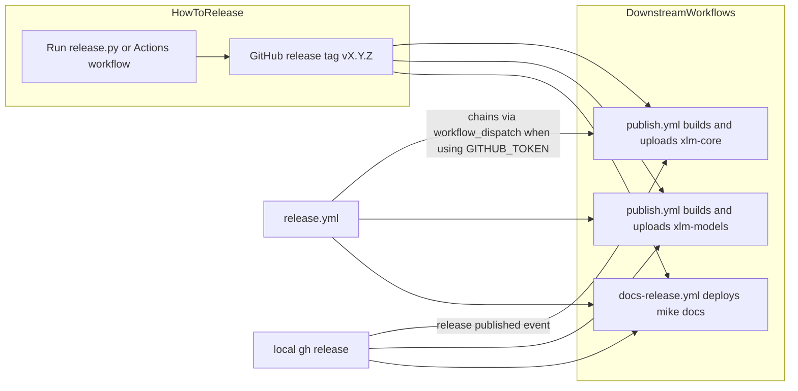

# Releasing to PyPI

This page covers how to publish **xlm-core** and **xlm-models** to PyPI and refresh release docs.

**How to release** is the step-by-step procedure. **How it works** explains the workflows, version sources, and GitHub Actions behavior for maintainers.

## How to release

Use this section when you want to ship a new version. For pipeline details, see [How it works](#how-it-works) below.

### Before you start

- [`gh`](https://cli.github.com/) installed and authenticated (`gh auth login`) — required for the local path only
- Push access to `main`
- Clean working tree (no uncommitted changes)
- Version string ready: `MAJOR.MINOR.PATCH`, with optional `-suffix` (e.g. `0.1.4-alpha` → tag `v0.1.4-alpha`)

### Recommended: release locally

1. From the repository root, run {{ gh('.github/release.py', 'release.py') }} with the new version.
2. Confirm when prompted (skip with `--yes`).
3. Wait for GitHub Actions. **Upload Python Package** and **Deploy Release Docs to GitHub Pages** should start after the GitHub release is published.

```bash
python .github/release.py 0.1.4          # interactive confirm
python .github/release.py 0.1.4 --yes    # non-interactive
python .github/release.py 0.1.4 --dry-run
```

If the version bump is already on `main` but the GitHub release was not created:

```bash
python .github/release.py --publish-only --yes
```

### Alternative: release via GitHub Actions

1. Open **Actions → Release xlm-core → Run workflow**.
2. Enter the version (and optionally enable dry run).
3. Wait for the release job to finish, then for **Upload Python Package** and **Deploy Release Docs to GitHub Pages**.

Both downstream workflows should appear in Actions after a successful non-dry-run release.

### If something went wrong

| Situation | What to run |
|-----------|-------------|
| Version already on `main`, no GitHub release | `python .github/release.py --publish-only --yes` |
| Release exists but PyPI upload missing | **Actions → Upload Python Package → Run workflow**, `tag_name=vX.Y.Z` |
| Release exists but docs missing | **Actions → Deploy Release Docs to GitHub Pages → Run workflow**, same tag |
| xlm-core uploaded but xlm-models failed | Re-run **Upload Python Package** with the same tag (twine may skip the existing xlm-core upload) |

### Manual release (legacy)

1. Update defaults in {{ gh('src/xlm/version.py', 'version.py') }} and {{ gh('xlm-models/version.py', 'xlm-models/version.py') }} (e.g. `0.1.2`).
2. Commit and push to `main`.
3. Create a GitHub release with tag `v0.1.2` on that commit and publish it.

### Version format

Supported: `MAJOR.MINOR.PATCH` with optional pre-release suffix `-label` (e.g. `0.1.4-alpha`). Tags use a `v` prefix (`v0.1.4`).

---

## How it works

This section is for maintainers debugging releases or changing workflows.

### Pipeline overview

A release bumps the version on `main`, creates a GitHub release tag, then triggers PyPI upload (both packages) and docs deployment.



| Workflow | File | Normal trigger | Effect |
|----------|------|----------------|--------|
| Release xlm-core | {{ gh('.github/workflows/release.yml', 'release.yml') }} | `workflow_dispatch` | Runs {{ gh('.github/release.py', 'release.py') }} |
| Upload Python Package | {{ gh('.github/workflows/publish.yml', 'publish.yml') }} | `release: published` or manual | Build wheel/sdist for **xlm-core** and **xlm-models**; upload both to PyPI |
| Deploy Release Docs | {{ gh('.github/workflows/docs-release.yml', 'docs-release.yml') }} | `release: published` or manual | Deploy versioned docs via mike |

### What `release.py` does

{{ gh('.github/release.py', 'release.py') }} is used locally and from {{ gh('.github/workflows/release.yml', 'release.yml') }}. It:

1. Patches default values in {{ gh('src/xlm/version.py', 'version.py') }} and {{ gh('xlm-models/version.py', 'xlm-models/version.py') }}
2. Verifies parsed `VERSION` matches the requested release in both files
3. Commits and pushes to `main`
4. Runs `gh release create v<version> --generate-notes`

The GitHub release tag is always `v` plus the version in `version.py` after the bump, so the tag and files stay aligned.

Release notes are generated from merged PRs since the previous tag. Categories and exclusions are configured in {{ gh('.github/release.yml', 'release.yml') }} using **labels on pull requests** (see {{ gh('CONTRIBUTING.md', 'CONTRIBUTING.md') }}). Maintainers should label PRs at merge time so notes land under Breaking changes, Models, Tasks and datasets, Bug fixes, Documentation, or Enhancements.

### Local vs GitHub Actions release paths

How PyPI and docs workflows start depends on where the GitHub release is created.

**Local `gh release create`** (your OAuth/PAT): GitHub emits `release: published`. {{ gh('.github/workflows/publish.yml', 'publish.yml') }} and {{ gh('.github/workflows/docs-release.yml', 'docs-release.yml') }} start automatically.

**Release created inside Actions** via `GITHUB_TOKEN`: GitHub does **not** emit `release: published` to other workflows. {{ gh('.github/workflows/release.yml', 'release.yml') }} therefore chains PyPI and docs explicitly via `gh workflow run ...` after a non-dry-run release.

This is why a release run from Actions still triggers upload and docs deploy, even though the event path differs from a local release.

### Version sources

Two layers matter:

- **`version.py` defaults** — source of truth on `main` after the bump. {{ gh('setup.py', 'setup.py') }} reads `VERSION` from `src/xlm/version.py` via `exec()`. {{ gh('xlm-models/setup.py', 'xlm-models/setup.py') }} reads from {{ gh('xlm-models/version.py', 'xlm-models/version.py') }} and pins `install_requires` to `xlm-core==VERSION`.
- **Release tag + env vars** — {{ gh('.github/workflows/publish.yml', 'publish.yml') }} extracts `XLM_CORE_VERSION_*` from the tag at build time. These override defaults during the PyPI build for both packages.

Keeping both `version.py` files in sync avoids confusion when installing from `main`.

### Required secrets

One-time repo setup under **Settings → Secrets and variables → Actions**:

- `PYPI_USERNAME` — PyPI username
- `PYPI_TOKEN` — PyPI API token

### xlm-models

{{ gh('xlm-models/setup.py', 'xlm-models/setup.py') }} is published alongside {{ gh('setup.py', 'setup.py') }} by {{ gh('.github/workflows/publish.yml', 'publish.yml') }}. Both packages share the same version number. `xlm-models` declares `install_requires=[f"xlm-core=={VERSION}"]`, so `pip install xlm-models==X.Y.Z` always pulls the matching `xlm-core` release. {{ gh('.github/workflows/publish.yml', 'publish.yml') }} uploads `xlm-core` first, then `xlm-models`.
