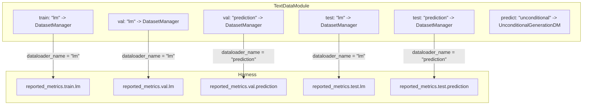
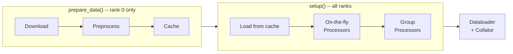

# Data Pipeline

`TextDataModule` is a Lightning `DataModule` that orchestrates the full data
lifecycle -- download, preprocessing, caching, creation of dataloaders. It holds
one or more `DatasetManager` instances per split (train, val, test, predict).
Each manager is registered under a **dataloader name** (e.g. `"lm"`,
`"prediction"`), and that same name is used by the `Harness` to look up the
metric group that should be evaluated on the corresponding dataloader.
Understanding this naming link is the single most important thing for working
with the pipeline.

## Architecture Overview

The following diagram shows a typical setup.  Each box on the left is a
`DatasetManager` registered under a dataloader name inside `TextDataModule`.
The arrows show how that same name is used by the `Harness` to find the
matching metric group on the right.



Internally, `TextDataModule` stores its managers as a nested dictionary:

```python
dataset_managers: Dict[
    Literal["train", "val", "test", "predict"],
    Dict[str, DatasetManager],  # key = dataloader name
]
```

The **train** split must contain exactly one `DatasetManager`; **val / test /
predict** can each contain zero or more, yielding a list of dataloaders.

On construction, `TextDataModule` assigns each dataloader name a numeric index
(the iteration order).  During a training or evaluation step the `Harness`
receives a `dataloader_idx` from the Lightning Trainer and resolves it back to
the dataloader name to find the right metrics:

```
dataloader_idx  (from Lightning Trainer)
      |
      v
dataloader_names[stage][idx]   -->  dataloader_name  (e.g. "lm")
      |
      v
reported_metrics["metrics_{stage}"][dataloader_name]  -->  list of MetricWrapper
```

Because the same name appears in both the datamodule config and the metrics
config, adding a new evaluation dataset with its own metrics is just a matter of
registering a new `DatasetManager` under a new name and adding a matching entry
in the metrics config.  For details on how metrics themselves are structured, see
the [Metrics](metrics.md) guide.

The `TextDataModule` lifecycle follows the standard Lightning pattern:

1. `prepare_data()` -- rank 0 only; delegates to each manager's
   `prepare_data()` (download + preprocess + cache).
2. `setup(stage)` -- all ranks; delegates to each manager's `setup()`
   (load from cache, apply processors, DDP splitting).
3. `{train,val,test,predict}_dataloader()` -- returns the configured
   `DataLoader`(s).

The following config example shows how the pieces fit together in practice.
Real configs live under `configs/lightning_train/datamodule/` and
`configs/lightning_train/model_type/`.

**Datamodule config** (`datamodule/lm1b.yaml`, simplified):

```yaml
datamodule:
  _target_: xlm.datamodule.TextDataModule
  dataset_managers:
    train: # <-- split name
      lm:                            # <-- dataloader name
        _target_: xlm.datamodule.DatasetManager
        full_name: billion-word-benchmark/lm1b/train
        preprocess_function: xlm.tasks.lm1b.preprocess_fn
        on_the_fly_processor: xlm.datamodule.token_ids_to_input_ids
        columns_to_remove: [text]
        stages: [fit]
        # ...
    val: # <-- split name
      lm:                            # <-- same dataloader name
        _target_: xlm.datamodule.DatasetManager
        full_name: billion-word-benchmark/lm1b/test
        stages: [fit, validate]
        # ...
      unconditional_prediction:      # <-- another dataloader name
        _target_: xlm.datamodule.UnconditionalGenerationDatasetManager
        # ...
```

**Alternative: sequence packing** (no padding, IterableDataset only):

```yaml
on_the_fly_processor: null
on_the_fly_group_processor: xlm.datamodule.pack_sequences
on_the_fly_group_processor_kwargs:
  drop_last: true
  use_bos: true
iterable_dataset_shards: 120  # required when using group processor
```

**Metrics config** (`model_type/mdlm.yaml`, simplified):

```yaml
reported_metrics:
  train:
    lm:                              # <-- must match dataloader name above
      accumulated_loss:
        prefix: train/lm
        update_fn: mdlm.metrics_mdlm.mean_metric_update_fn
  val:
    lm:                              # <-- must match
      accumulated_loss:
        prefix: val/lm
        update_fn: mdlm.metrics_mdlm.mean_metric_update_fn
```

The names `lm` and `unconditional_prediction` are the glue: they appear
identically in the datamodule and metrics configs.

## DatasetManager Lifecycle

Each `DatasetManager` owns a single dataset and drives it through a multi-stage
pipeline:



| Stage                     | When                       | What happens                                                                                                                                                             |
|---------------------------|----------------------------|--------------------------------------------------------------------------------------------------------------------------------------------------------------------------|
| **Download**              | `prepare_data()` (rank 0)  | `datasets.load_dataset()` fetches from HuggingFace Hub. `LocalDatasetManager` overrides this to load local CSV files instead.                                            |
| **Preprocess**            | `prepare_data()` (rank 0)  | A configurable function (dotted-path string, e.g. a tokenization function) is applied via `dataset.map()`. Unwanted columns are dropped.                                 |
| **Cache**                 | `prepare_data()` (rank 0)  | The preprocessed dataset is saved to disk (`manual_cache_dir / full_name`) with `save_to_disk()`. Subsequent runs skip download + preprocess.                            |
| **Setup**                 | `setup(stage)` (all ranks) | Loads from cache. Optionally converts to `IterableDataset` (sharded). Applies on-the-fly and group processors. Splits by node in DDP.                                    |
| **On-the-fly Processors** | Lazy, per-example          | Per-example transforms applied via `dataset.map(batched=False)`. Example: `token_ids_to_input_ids` converts raw token IDs into `input_ids`, `attention_mask`, `token_type_ids`. |
| **Group Processors**      | Lazy, batched              | Operates on large chunks of examples, e.g. sequence packing to `block_size` without padding. Requires `iterable_dataset_shards` (IterableDataset only; changes number of examples). Mutually exclusive with `on_the_fly_processor`. Use `pack_sequences` with `on_the_fly_group_processor_kwargs` for `drop_last` / `use_bos`. |
| **Collation**             | DataLoader                 | A `Collator` converts a list of examples into a `BaseBatch` tensor dict (`input_ids`, `attention_mask`, `token_type_ids`).                                               |

### On-the-fly vs Group Processors

**Per-example** (`on_the_fly_processor`): One example in, one out. Examples: `ids_to_example_fn`, `token_ids_to_input_ids`. Applied via `dataset.map(batched=False)`.

**Group** (`on_the_fly_group_processor`): Batch in, packed blocks out. Example: `pack_sequences` concatenates sequences with BOS/EOS and chunks into fixed-size blocks. Requires `iterable_dataset_shards` (IterableDataset); cannot be combined with `on_the_fly_processor`.

### Dataloader and Sampler Selection

`get_dataloader()` picks the loader class and sampler based on three axes:
split, DDP, and dataset type.

| Split | DDP | Iterable | Loader | Sampler | Notes |
|-------|-----|----------|--------|---------|-------|
| train | yes | yes | `StatefulDataLoader` | None | Shuffling handled by the IterableDataset shuffle buffer; explicit `shuffle` kwarg is ignored. Shards split across workers during `setup()`. |
| train | yes | no | `StatefulDataLoader` | `StatefulDistributedSampler` | Partitions data across ranks and shuffles (disabled under `DEBUG_OVERFIT`). |
| train | no | no | `StatefulDataLoader` | `RandomSampler` | Single-GPU. Falls back to `SequentialSampler` under `DEBUG_OVERFIT`. |
| train | no | yes | `StatefulDataLoader` | None | Single-GPU with iterable dataset; no sampler needed. |
| val / test / predict | any | any | `DataLoader` | None | Never shuffled. Standard (non-stateful) `DataLoader`. |

All train dataloaders use `StatefulDataLoader` (from `torchdata`) so that
iteration state can be checkpointed and resumed mid-epoch.
