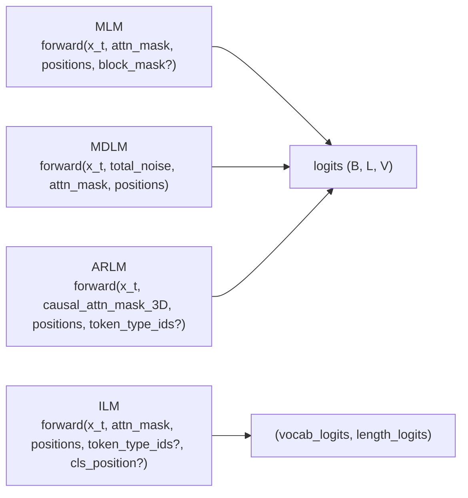

# Models

Each `xlm-models/<family>/` package implements one language-modeling paradigm against a small set of shared `xlm.*` abstractions. The four families documented here — **ARLM**, **ILM**, **MDLM**, **MLM** — share the same component layout (model, loss, predictor, collator, metrics, types) but differ in what they predict and how they decode.

## Shared abstractions

Every family wires the same five interfaces from `xlm-core`:

| Abstraction | Module | Key methods | Family-specific subclass |
|---|---|---|---|
| `Model` | [src/xlm/model.py](../../src/xlm/model.py) | `get_named_params_for_weight_decay`, `get_named_params_for_no_weight_decay` | `RotaryTransformer<X>Model`, `MDLMModel` |
| `LossFunction[T_in, T_out]` | [src/xlm/harness.py](../../src/xlm/harness.py) | `configure`, `loss_fn`, `__call__` | `<X>Loss` |
| `Predictor[T_in, T_out_pred]` | [src/xlm/harness.py](../../src/xlm/harness.py) | `predict`, `to_dict`, `generate` | `<X>Predictor` |
| `Collator` | [src/xlm/datamodule.py](../../src/xlm/datamodule.py) | `__call__(examples) -> Batch` | `Default<X>Collator`, seq2seq variants |
| `MetricWrapper` updates | [src/xlm/metrics.py](../../src/xlm/metrics.py) | `*_update_fn(batch, loss_dict, tokenizer=None)` | `<X>/metrics_<X>.py` |

What differs across families is the **forward signature** and the **batch contract**:

## Family comparison

| | ARLM | ILM | MDLM | MLM |
|---|---|---|---|---|
| **Paradigm** | Left-to-right causal LM | Insertion LM | Masked discrete diffusion (continuous-time absorbing) | Masked LM (BERT-style) |
| **Backbone** | `RotaryTransformerLayer` (RoPE) | `RotaryTransformerLayer` *or* GPT-2 backbone | `DDiTLayer` (AdaLN + RoPE), time conditioning via `TimestepEmbedder` | `RotaryTransformerLayer` (RoPE) |
| **Conditioning signal** | Causal 3-D mask | Optional `token_type_ids` + `cls_position` | Continuous-time `t` -> `total_noise` (passed as AdaLN cond) | None beyond `attention_mask` (+ optional `block_mask`) |
| **Forward output** | `logits (B, L, V)` | `(vocab_logits, length_logits)` — `length_logits` is `None` for the base model | `logits (B, L, V)` | `logits (B, L, V)` |
| **Loss type** | Cross-entropy with `ignore_index=-100` | Masked CE over dropped positions, optional length CE / binary CE head | Weighted CE (`noise_rate / expm1(total_noise)`) on `[MASK]` positions | Cross-entropy on `[MASK]` positions only (default) |
| **Default collator** | `DefaultARLMCollator` | `DefaultILMCollator` (token-drop noising) | `DefaultMDLMCollator` (needs real noise schedule) | `DefaultMLMCollator` |
| **Seq2seq collators** | `ARLMSeq2SeqCollator`, `ARLMSeq2SeqPredCollator` | `ILMSeq2SeqCollator`, `ILMSeq2SeqPredCollator` | `MDLMSeq2SeqTrainCollator`, `MDLMSeq2SeqPredCollator` | `MLMSeq2SeqCollator`, `MLMSeq2SeqTrainCollator`, `MLMSeq2SeqPredCollator`, `_MLMSeq2SeqPredCollator`, `MLMInfillWithExactTargetPredCollator`, `DefaultInfillMLMCollator`, `PackedMLMCollator` |
| **Decoding loop** | Greedy / top-k / top-p sampled tokens, one per step, up to `max_length` | Insertion at a chosen position per step; optional length-head stopping | `max_steps` unmasking steps with diffusion sampling and `dt` time decrement | `max_steps` unmasking steps; uniform or confidence-based position selection (`prob_diff` / `top_prob`) |
| **Source package** | [xlm-models/arlm/](../../xlm-models/arlm) | [xlm-models/ilm/](../../xlm-models/ilm) | [xlm-models/mdlm/](../../xlm-models/mdlm) | [xlm-models/mlm/](../../xlm-models/mlm) |
| **Per-family doc** | [arlm.md](arlm.md) | [ilm.md](ilm.md) | [mdlm.md](mdlm.md) | [mlm.md](mlm.md) |

## Page layout

Every per-family page follows the same template:

1. **Overview** — paradigm, paper citation
2. **Files at a glance** — public classes/functions per module
3. **Architecture** — forward signature and inputs/outputs
4. **Batch contract** — required vs optional fields with shapes
5. **Loss** — math and masking rules
6. **Collators** — table of all collator classes
7. **Predictor** — decoding loop, stopping rule, output dict
8. **Metrics** — update_fn callables
9. **Configs / experiments** — pointer to `xlm-models/<family>/configs/`
10. **Testing** — pointer to `tests/models/<family>/`
11. **API reference** — mkdocstrings links

Read [external-models.md](../guide/external-models.md) for how to scaffold a new family that conforms to this contract.
