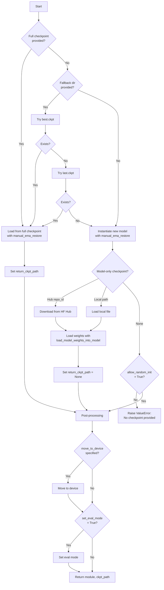

# Model Loading for Inference

This document explains how to load models for inference tasks (generation, evaluation, push to hub, demos) using the unified `load_model_for_inference()` function.

## Overview

The `load_model_for_inference()` function in `src/xlm/utils/model_loading.py` provides a consistent interface for loading models across all inference commands. It handles:

- Loading from full Lightning checkpoints (includes optimizer state, callbacks, etc.)
- Loading from model-only checkpoints (just model weights)
- Downloading and loading from Hugging Face Hub
- Automatic fallback to `best.ckpt` or `last.ckpt` (for evaluation)
- Safety validation to prevent inference on untrained models

## Checkpoint Loading Decision Flow



## API Reference

### Function Signature

```python
def load_model_for_inference(
    cfg: DictConfig,
    datamodule: Any,
    tokenizer: Any,
    *,
    config_prefix: str,
    manual_ema_restore: bool = False,
    move_to_device: Optional[str] = None,
    set_eval_mode: bool = False,
    enable_hub_support: bool = True,
    checkpoint_fallback_dir: Optional[str] = None,
    allow_random_init: bool = False,
) -> tuple[Harness, Optional[str]]
```

### Parameters

| Parameter | Type | Default | Description |
|-----------|------|---------|-------------|
| `cfg` | `DictConfig` | *required* | Hydra config containing model and checkpoint configuration |
| `datamodule` | `Any` | *required* | Datamodule instance for model instantiation |
| `tokenizer` | `Any` | *required* | Tokenizer instance for model instantiation |
| `config_prefix` | `str` | *required* | Prefix for config keys (e.g., "generation", "eval", or "" for top-level) |
| `manual_ema_restore` | `bool` | `False` | Pass `manual_ema_restore=True` to model loading for manual EMA control |
| `move_to_device` | `Optional[str]` | `None` | Device to move model to ("cuda", "cpu", or None for default) |
| `set_eval_mode` | `bool` | `False` | Call `model.eval()` after loading (False when trainer handles this) |
| `enable_hub_support` | `bool` | `True` | Support loading from `hub.repo_id` config |
| `checkpoint_fallback_dir` | `Optional[str]` | `None` | Directory to search for best.ckpt/last.ckpt if no explicit checkpoint |
| `allow_random_init` | `bool` | `False` | Allow instantiating randomly initialized model (safety feature) |

### Returns

Returns a tuple of `(lightning_module, checkpoint_path)`:
- `lightning_module`: The loaded `Harness` model ready for inference
- `checkpoint_path`: Path to full checkpoint (or `None` if using model-only checkpoint). Used by eval command to pass to trainer.

### Raises

- `ValueError`: If no checkpoint is found and `allow_random_init=False`
- `ValueError`: If checkpoint file doesn't exist

## Configuration Key Mapping

The function looks for checkpoints in your config based on the `config_prefix`:

### Full Checkpoint Keys

| `config_prefix` | Config Key | Used By |
|-----------------|------------|---------|
| `"generation"` | `cfg.generation.ckpt_path` | Generation command |
| `"eval"` | `cfg.eval.checkpoint_path` | Evaluation command |
| `""` (empty) | `cfg.hub_checkpoint_path` | Push to Hub command |

### Model-Only Checkpoint Keys

| `config_prefix` | Config Key | Used By |
|-----------------|------------|---------|
| `"generation"` | `cfg.generation.model_only_checkpoint_path` | Generation command |
| `"eval"` | `cfg.eval.model_only_checkpoint_path` | Evaluation command |
| `""` (empty) | `cfg.model_only_checkpoint_path` | Push to Hub command |

### Hugging Face Hub Keys

When `enable_hub_support=True`, the function also checks:
- `cfg.hub.repo_id` - Repository ID on Hugging Face Hub
- `cfg.hub.revision` - Git revision (branch, tag, or commit), defaults to "main"

## Usage Examples by Command

### Generation (`lightning_generate.py`)

**Configuration:**
- Full HF Hub support enabled
- Manual EMA restore for generation quality
- Moves model to CUDA
- Sets eval mode

```python
from xlm.utils.model_loading import load_model_for_inference

def instantiate_model(cfg, datamodule, tokenizer):
    module, _ = load_model_for_inference(
        cfg,
        datamodule,
        tokenizer,
        config_prefix="generation",
        manual_ema_restore=True,
        move_to_device="cuda",
        set_eval_mode=True,
        enable_hub_support=True,
        allow_random_init=False,
    )
    return module
```

**Config Example:**
```yaml
generation:
  ckpt_path: /path/to/checkpoint.ckpt
  # OR
  model_only_checkpoint_path: /path/to/model_weights.pt
  # OR use HF Hub
hub:
  repo_id: username/model-name
  revision: main
```

### Evaluation (`lightning_eval.py`)

**Configuration:**
- Fallback to best.ckpt/last.ckpt if no explicit checkpoint
- Returns checkpoint path for trainer
- Trainer handles device movement and eval mode
- No manual EMA restore (callbacks handle this)

```python
from xlm.utils.model_loading import load_model_for_inference

def instantiate_model(cfg, datamodule, tokenizer):
    return load_model_for_inference(
        cfg,
        datamodule,
        tokenizer,
        config_prefix="eval",
        manual_ema_restore=False,
        move_to_device=None,  # Trainer handles device
        set_eval_mode=False,  # Trainer handles eval mode
        enable_hub_support=True,
        checkpoint_fallback_dir=cfg.checkpointing_dir,
        allow_random_init=False,
    )

# Usage with trainer
lightning_module, ckpt_path = instantiate_model(cfg, datamodule, tokenizer)
trainer.validate(model=lightning_module, datamodule=datamodule, ckpt_path=ckpt_path)
```

**Config Example:**
```yaml
checkpointing_dir: ./checkpoints
eval:
  checkpoint_path: /path/to/checkpoint.ckpt  # Optional, falls back to best/last
  # OR
  model_only_checkpoint_path: /path/to/model_weights.pt
```

### Push to Hub (`push_to_hub.py`)

**Configuration:**
- Uses top-level config keys (no prefix)
- Hub support disabled (uses different hub config structure)
- Manual EMA restore before pushing
- Moves to CUDA and sets eval mode

```python
from xlm.utils.model_loading import load_model_for_inference

def instantiate_model(cfg, datamodule, tokenizer):
    module, _ = load_model_for_inference(
        cfg,
        datamodule,
        tokenizer,
        config_prefix="",  # Top-level keys
        manual_ema_restore=True,
        move_to_device="cuda",
        set_eval_mode=True,
        enable_hub_support=False,
        allow_random_init=False,
    )
    return module
```

**Config Example:**
```yaml
hub_checkpoint_path: /path/to/checkpoint.ckpt
# OR
model_only_checkpoint_path: /path/to/model_weights.pt

hub:
  repo_id: username/model-name  # Where to push
  commit_message: "Upload model weights"
```

### CLI Demo (`cli_demo.py`)

**Configuration:**
- Simplified for interactive use
- No manual EMA restore
- Moves to CUDA and sets eval mode
- Hub support disabled

```python
from xlm.utils.model_loading import load_model_for_inference

def instantiate_model(cfg, datamodule, tokenizer):
    module, _ = load_model_for_inference(
        cfg,
        datamodule,
        tokenizer,
        config_prefix="generation",
        manual_ema_restore=False,
        move_to_device="cuda",
        set_eval_mode=True,
        enable_hub_support=False,
        allow_random_init=False,
    )
    return module
```

**Config Example:**
```yaml
generation:
  ckpt_path: /path/to/checkpoint.ckpt
```

## Safety Features

### `allow_random_init` Guard

By default, `allow_random_init=False` prevents accidentally running inference on a randomly initialized (untrained) model. If no checkpoint is provided, the function will raise a `ValueError` with a helpful message.

**Why this matters:**
- Prevents silent failures where you think you're using a trained model but aren't
- Forces explicit checkpoint configuration
- Catches configuration errors early

**When to set `allow_random_init=True`:**
- Testing model architecture before training
- Debugging dataloader/inference pipeline
- Explicitly want random weights for some reason

**Example error message:**
```
ValueError: No checkpoint provided for model loading.
Please provide one of:
- generation.ckpt_path / checkpoint_path
- generation.model_only_checkpoint_path
- hub.repo_id
Or set allow_random_init=True to use randomly initialized weights.
```

### Conflict Detection

The function validates mutually exclusive checkpoint options:

1. **Full checkpoint vs. model-only checkpoint**: Cannot provide both for the same model
2. **HF Hub vs. local model-only checkpoint**: Cannot provide both (Hub takes precedence)
3. **Full checkpoint vs. anything else**: Full checkpoint is used, others are ignored

Conflicts are logged as errors but don't crash the program - the most specific checkpoint source is used.

## Advanced Topics

### EMA Weight Handling

Exponential Moving Average (EMA) weights improve generation quality but require careful handling:

- **Generation/Push to Hub**: Use `manual_ema_restore=True` to ensure EMA weights are loaded
- **Evaluation**: Use `manual_ema_restore=False` and let callbacks handle EMA
- **Model-only checkpoints**: Should have EMA already applied when saved

### Checkpoint Return Value

The second return value (checkpoint path) is important for evaluation:

- **Full checkpoint loaded**: Returns the checkpoint path so trainer can properly restore callbacks/hooks
- **Model-only checkpoint**: Returns `None` to prevent trainer from reloading
- **Random init**: Returns `None` (no checkpoint exists)

### Device Management

Different commands have different device requirements:

- **Trainer-based (eval)**: Set `move_to_device=None`, trainer handles device placement
- **Manual inference (generate, demo)**: Set `move_to_device="cuda"` for GPU inference
- **Push to hub**: Set `move_to_device="cuda"` to load weights on GPU before extracting

### Fallback Logic

Evaluation command uses `checkpoint_fallback_dir` to automatically find checkpoints:

1. Check explicit `eval.checkpoint_path`
2. Try `{checkpoint_fallback_dir}/best.ckpt`
3. Try `{checkpoint_fallback_dir}/last.ckpt`
4. If all fail and no model-only checkpoint, raise error

This makes evaluation convenient - you don't need to specify the exact checkpoint path.

## Best Practices

1. **Always specify a checkpoint** for production inference/evaluation
2. **Use HF Hub** for sharing models across team/experiments
3. **Enable fallback** for evaluation to automatically use best checkpoint
4. **Check logs** for conflict warnings about multiple checkpoint sources
5. **Verify EMA settings** match your checkpoint type (manual vs. callback-based)
6. **Keep `allow_random_init=False`** unless you have a specific reason to change it

## Troubleshooting

### "No checkpoint provided" error

**Cause**: No checkpoint configured and `allow_random_init=False`

**Solution**: Add one of:
- `{prefix}.ckpt_path` or `{prefix}.checkpoint_path`
- `{prefix}.model_only_checkpoint_path`
- `hub.repo_id` (if `enable_hub_support=True`)

### Model weights seem wrong

**Cause**: Might be loading checkpoint without EMA weights

**Solution**: 
- Check if your checkpoint was saved with EMA
- Verify `manual_ema_restore` setting matches your use case
- Check logs for "Loading weights" messages

### Checkpoint conflicts in logs

**Cause**: Multiple checkpoint sources provided in config

**Solution**: Remove conflicting config entries, keep only one checkpoint source

### "Checkpoint path does not exist" error

**Cause**: Path in config points to non-existent file

**Solution**: 
- Verify the path is correct
- Check if file was moved/deleted
- Use fallback directory for evaluation instead of explicit path
